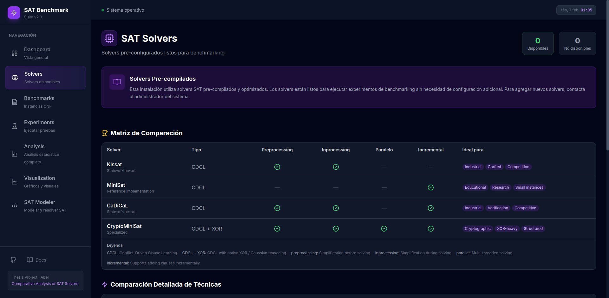
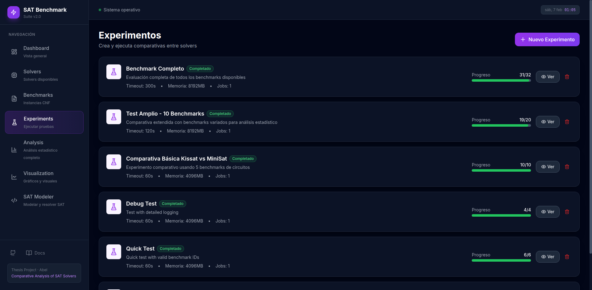
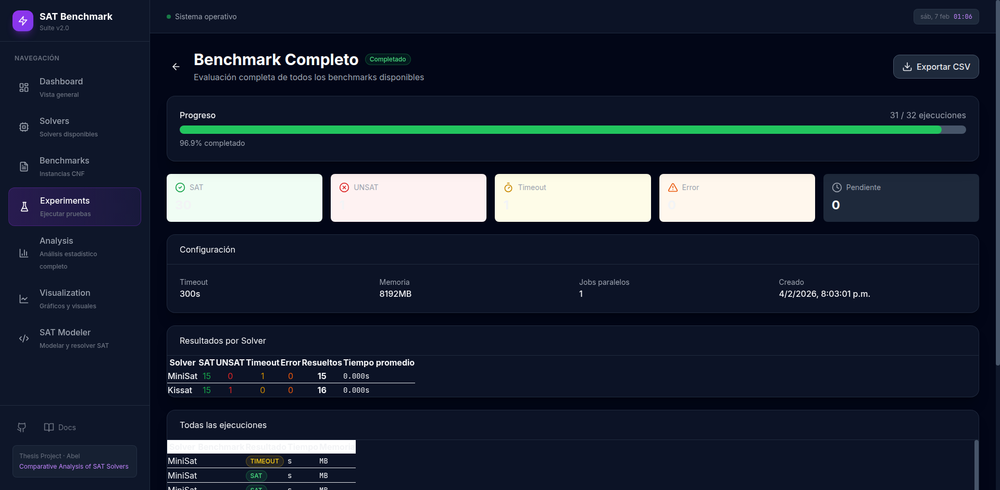
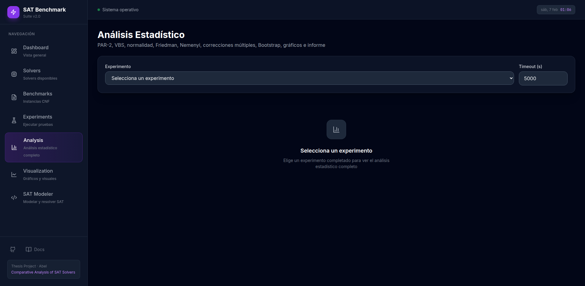
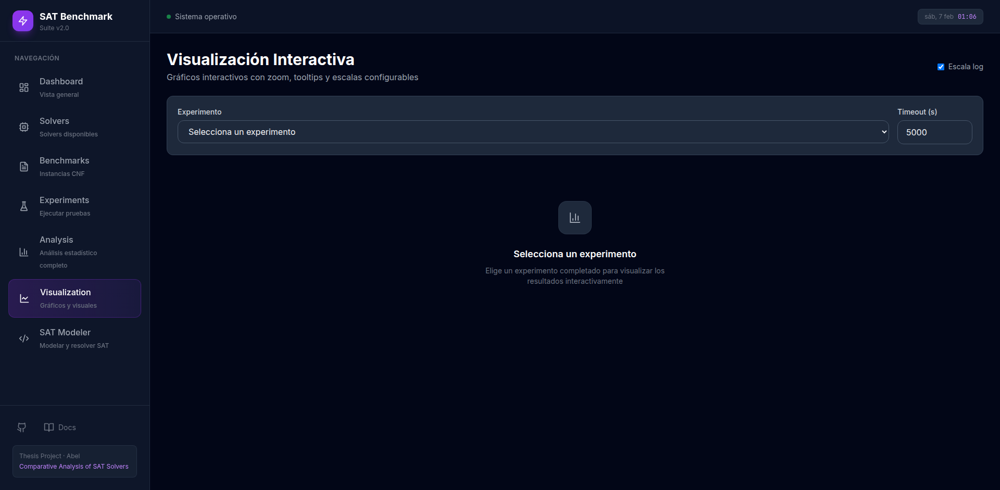
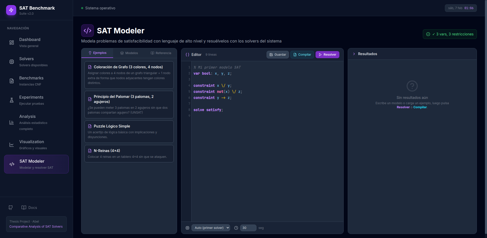

<div align="center">

# 📋 Informe Técnico: SAT Benchmark Suite v2.0

## Plataforma Integral para Benchmarking y Análisis Estadístico Riguroso de Solvers SAT

---

**Autor:** Abel  
**Fecha:** Febrero 2025  
**Versión del Sistema:** 2.0  

</div>

---

## Tabla de Contenidos

1. [Introducción](#1-introducción)
2. [Motivación y Objetivos](#2-motivación-y-objetivos)
3. [Arquitectura del Sistema](#3-arquitectura-del-sistema)
4. [Módulos de la Aplicación](#4-módulos-de-la-aplicación)
   - 4.1 [Dashboard](#41-dashboard)
   - 4.2 [Solvers](#42-solvers)
   - 4.3 [Benchmarks](#43-benchmarks)
   - 4.4 [Experiments](#44-experiments)
   - 4.5 [Analysis](#45-analysis)
   - 4.6 [Visualization](#46-visualization)
   - 4.7 [SAT Modeler](#47-sat-modeler)
5. [Pipeline de Análisis Estadístico Riguroso](#5-pipeline-de-análisis-estadístico-riguroso)
   - 5.1 [Métricas Base](#51-métricas-base)
   - 5.2 [Tests de Normalidad](#52-tests-de-normalidad)
   - 5.3 [Tests Estadísticos](#53-tests-estadísticos)
   - 5.4 [Correcciones para Comparaciones Múltiples](#54-correcciones-para-comparaciones-múltiples)
   - 5.5 [Tamaños de Efecto](#55-tamaños-de-efecto)
   - 5.6 [Intervalos de Confianza Bootstrap](#56-intervalos-de-confianza-bootstrap)
   - 5.7 [Visualizaciones Publicables](#57-visualizaciones-publicables)
   - 5.8 [Generación de Reportes](#58-generación-de-reportes)
6. [Motor de Ejecución de Experimentos](#6-motor-de-ejecución-de-experimentos)
7. [SAT Modeler: Lenguaje y Compilador](#7-sat-modeler-lenguaje-y-compilador)
8. [Base de Datos y Modelo de Datos](#8-base-de-datos-y-modelo-de-datos)
9. [API REST: Catálogo Completo de Endpoints](#9-api-rest-catálogo-completo-de-endpoints)
10. [Stack Tecnológico Detallado](#10-stack-tecnológico-detallado)
11. [Despliegue y Configuración](#11-despliegue-y-configuración)
12. [Conclusiones y Trabajo Futuro](#12-conclusiones-y-trabajo-futuro)
13. [Referencias Bibliográficas](#13-referencias-bibliográficas)

---

## 1. Introducción

El **Problema de Satisfacibilidad Booleana (SAT)** es un problema fundamental en ciencias de la computación, siendo el primer problema demostrado NP-completo (Cook, 1971). Su resolución eficiente tiene implicaciones directas en verificación formal, planificación, criptoanálisis, diseño de circuitos y optimización combinatoria. La comunidad SAT ha desarrollado solvers cada vez más sofisticados basados en la técnica **CDCL (Conflict-Driven Clause Learning)**, y la evaluación comparativa rigurosa de estos solvers es crucial para el avance del campo.

**SAT Benchmark Suite v2.0** es una plataforma web completa que integra todo el ciclo de vida del benchmarking de solvers SAT: desde la gestión de solvers y la importación de instancias CNF, pasando por la ejecución controlada de experimentos, hasta el análisis estadístico con rigor académico y la generación de reportes publicables. Adicionalmente, incorpora un IDE integrado (SAT Modeler) que permite a los usuarios modelar y resolver problemas SAT usando un lenguaje de alto nivel inspirado en MiniZinc.

---

## 2. Motivación y Objetivos

### 2.1 Motivación

La comparación de solvers SAT en la literatura frecuentemente carece de rigor estadístico. Muchos estudios se limitan a comparar tiempos promedio sin considerar:

- La distribución no normal de los tiempos de ejecución
- La necesidad de tests no paramétricos para datos de benchmarking
- Las correcciones necesarias al realizar múltiples comparaciones
- La cuantificación del tamaño del efecto más allá de la significancia estadística
- La reproducibilidad mediante intervalos de confianza

### 2.2 Objetivos

1. **Automatizar** el proceso completo de benchmarking de solvers SAT
2. **Implementar** un pipeline estadístico riguroso siguiendo la metodología de Demšar (2006)
3. **Generar** visualizaciones de calidad publicable (cactus plots, ECDF, critical difference diagrams)
4. **Proveer** una interfaz web moderna e intuitiva para investigadores
5. **Integrar** un IDE de modelado SAT para facilitar la creación de instancias de prueba
6. **Garantizar** reproducibilidad mediante seeds fijos, exports de datos y reportes automatizados

---

## 3. Arquitectura del Sistema

### 3.1 Diagrama de Arquitectura

```
┌──────────────────────────────────────────────────────────────────────────┐
│                         SAT Benchmark Suite v2.0                         │
│                                                                          │
│  ┌─────────────────┐    ┌──────────────┐    ┌────────────────────────┐  │
│  │    FRONTEND      │    │    NGINX      │    │       BACKEND          │  │
│  │                  │    │              │    │                        │  │
│  │  React 18        │    │  Reverse     │    │  FastAPI (Python 3.11) │  │
│  │  TypeScript 5.3  │◄──►│  Proxy       │◄──►│                        │  │
│  │  Vite 5          │    │  Rate Limit  │    │  ┌──────────────────┐  │  │
│  │  TailwindCSS 3.4 │    │  Gzip        │    │  │ API Layer        │  │  │
│  │  Recharts 2      │    │  SPA         │    │  │ 8 routers        │  │  │
│  │  TanStack Query 5│    │  Fallback    │    │  │ 63+ endpoints    │  │  │
│  │  Zustand 4       │    │              │    │  └──────────────────┘  │  │
│  │                  │    │  Puerto: 80  │    │  ┌──────────────────┐  │  │
│  │  Puerto: 5173    │    │  (producción)│    │  │ Analysis Engine  │  │  │
│  │  (desarrollo)    │    └──────────────┘    │  │ • statistics.py  │  │  │
│  └─────────────────┘                         │  │ • bootstrap.py   │  │  │
│                                              │  │ • metrics.py     │  │  │
│                                              │  │ • plots.py       │  │  │
│  ┌──────────────────────────────────────┐    │  │ • reports.py     │  │  │
│  │           PERSISTENCIA               │    │  └──────────────────┘  │  │
│  │                                      │    │  ┌──────────────────┐  │  │
│  │  📁 data/experiments.db  (SQLite)    │◄──►│  │ Solver Runner    │  │  │
│  │  📁 data/models/         (JSON)      │    │  │ Process mgmt     │  │  │
│  │  📁 data/generated_cnf/  (DIMACS)    │    │  │ CDCL parsing     │  │  │
│  │  📁 solvers/kissat/      (binario)   │    │  │ Timeout control  │  │  │
│  │  📁 solvers/minisat/     (binario)   │    │  └──────────────────┘  │  │
│  │  📁 benchmarks/          (CNF files) │    │                        │  │
│  └──────────────────────────────────────┘    │  Puerto: 8000          │  │
│                                              └────────────────────────┘  │
│                                                                          │
│                         Docker Compose                                   │
│  ┌──────────────┐  ┌──────────────┐  ┌────────────────────────────────┐ │
│  │  frontend     │  │    nginx     │  │          backend               │ │
│  │  node:20-     │  │  nginx:      │  │  python:3.11-slim              │ │
│  │  alpine       │  │  alpine      │  │  + gcc + make + git            │ │
│  │  (dev HMR)    │  │  (prod only) │  │  (para compilar solvers)       │ │
│  └──────────────┘  └──────────────┘  └────────────────────────────────┘ │
└──────────────────────────────────────────────────────────────────────────┘
```

### 3.2 Flujo de Datos

```
Usuario ──► Frontend (React) ──► HTTP/WS ──► Backend (FastAPI)
                                                    │
                                    ┌───────────────┼───────────────┐
                                    ▼               ▼               ▼
                              SQLite DB       Solver Binaries   Analysis Engine
                              (CRUD +         (Kissat, MiniSat) (SciPy, NumPy,
                               queries)       + subprocess      Matplotlib)
                                    │               │               │
                                    └───────────────┼───────────────┘
                                                    ▼
                                            Resultados ──► Frontend
                                            (JSON, CSV, HTML, PDF, PNG)
```

---

## 4. Módulos de la Aplicación

La aplicación está organizada en **7 módulos principales**, cada uno con su propia página en el frontend y endpoints dedicados en el backend.

### 4.1 Dashboard

**Propósito:** Panel de control general que ofrece una vista rápida del estado del sistema.


*Figura 1: Dashboard principal mostrando métricas del sistema, distribución de resultados y actividad reciente.*

**Funcionalidades:**
- Contadores globales: número de solvers disponibles, benchmarks cargados y experimentos ejecutados
- Distribución de resultados: gráfico circular/de barras con la proporción SAT/UNSAT/TIMEOUT/ERROR
- Actividad reciente: lista de los últimos experimentos con su estado y progreso
- Resumen del estado del sistema

**Endpoints asociados:**
- `GET /api/dashboard/stats` — Estadísticas agregadas
- `GET /api/dashboard/recent-activity` — Actividad reciente

---

### 4.2 Solvers

**Propósito:** Gestión y visualización de los solvers SAT disponibles en el sistema.


*Figura 2: Módulo de Solvers con catálogo de solvers pre-configurados y matriz de comparación de características.*

**Funcionalidades:**
- **Catálogo de solvers**: Tarjetas informativas para cada solver con nombre, versión, categoría, estado y features
- **Detección automática de versión**: El sistema ejecuta `--version` en el binario del solver para verificar la versión real instalada, usando un cache de versiones detectadas
- **Matriz de comparación**: Tabla lado a lado con las características técnicas de cada solver (tipo SAT, técnica CDCL, features especiales como preprocessing, vivification, etc.)
- **Test de ejecutabilidad**: Botón para verificar que el binario funciona correctamente
- **Estado en tiempo real**: Indicadores visuales de "ready" (listo), "not_installed", "error"

**Solvers Pre-configurados:**

| Solver | Versión | Categoría | Features Principales |
|--------|---------|-----------|---------------------|
| Kissat | 4.0.4 | Competition | CDCL, Preprocessing, Inprocessing, Vivification, Lucky phases, Focused/Stable modes |
| MiniSat | 2.2.0 | Educational | CDCL, VSIDS, Two-watched literals, Phase saving, Clause database reduction |
| CaDiCaL | 2.1.3 | Competition | CDCL, Chronological backtracking, BVE, Bounded variable addition |
| CryptoMiniSat | 5.11.22 | Competition | CDCL, XOR reasoning, Gaussian elimination, Component analysis |

---

### 4.3 Benchmarks

**Propósito:** Gestión de instancias CNF (formato DIMACS) con capacidades avanzadas de importación, clasificación y navegación.


*Figura 3: Módulo de Benchmarks con paginación server-side, filtrado por familia/dificultad y estadísticas agregadas.*

**Funcionalidades:**
- **Paginación server-side**: Navegación eficiente en colecciones grandes (25 benchmarks por página) con queries SQL optimizadas
- **Filtrado avanzado**: Por familia (circuit, crypto, planning, graph, scheduling, random, crafted, industrial, verification, other), por dificultad (easy/medium/hard), y por búsqueda de texto libre
- **Estadísticas agregadas SQL**: Calculadas directamente en la base de datos:
  - Promedio de variables y cláusulas
  - Distribución de dificultad (conteos por categoría)
  - Total de benchmarks y familias
- **Upload con drag & drop**: Carga de archivos CNF con auto-clasificación inteligente de familia basada en el nombre del archivo y estimación de dificultad basada en el número de variables
- **Escaneo de directorio**: Importación masiva desde una carpeta del sistema de archivos
- **Preview DIMACS**: Visualización de las primeras N líneas del archivo CNF
- **Metadatos calculados automáticamente**: Variables, cláusulas, ratio cláusulas/variables, tamaño en bytes, hash MD5 para deduplicación

**Clasificación automática de dificultad:**
- **Easy**: < 1,000 variables
- **Medium**: 1,000 – 10,000 variables
- **Hard**: > 10,000 variables

---

### 4.4 Experiments

**Propósito:** Motor de ejecución de benchmarks con creación de experimentos, ejecución en background y monitoreo en tiempo real.


*Figura 4: Lista de experimentos con estados, progreso y opciones de gestión.*


*Figura 5: Detalle de un experimento completado mostrando configuración, distribución de resultados y tabla de runs individuales.*

**Funcionalidades:**
- **Creación flexible**: Selección múltiple de solvers y benchmarks con configuración de timeout, límite de memoria y número de repeticiones
- **Ejecución en background**: El experimento se ejecuta como tarea asíncrona sin bloquear la interfaz
- **Monitoreo WebSocket**: Actualizaciones en tiempo real del progreso (solver actual, benchmark actual, porcentaje completado)
- **Control de ejecución**: Start/Stop con cleanup automático de procesos hijos
- **Resultados detallados** por cada run individual:

| Categoría | Métricas |
|-----------|----------|
| **Resultado** | SAT, UNSAT, TIMEOUT, ERROR, UNKNOWN |
| **Exit codes** | 10 = SAT, 20 = UNSAT (estándar SAT Competition) |
| **Tiempos** | Wall time, CPU time, User time, System time |
| **Memoria** | Máxima (KB), Promedio (KB) |
| **CDCL** | Conflictos, Decisiones, Propagaciones, Restarts |
| **Cláusulas** | Aprendidas, Eliminadas |
| **Meta** | Output raw (≤10 KB), PAR-2 pre-calculado, hostname |

**Configuración por defecto:**
- Timeout: 5,000 segundos
- Límite de memoria: 8,192 MB
- Repeticiones: 1
- Jobs paralelos: 4

---

### 4.5 Analysis

**Propósito:** Módulo unificado de análisis estadístico con 10 pestañas especializadas que cubren todo el pipeline riguroso.


*Figura 6: Módulo de Analysis con sus 10 pestañas de análisis estadístico.*

**Pestañas:**

| # | Pestaña | Descripción |
|---|---------|-------------|
| 1 | **Overview** | Ranking PAR-2, conteo de instancias resueltas, resumen ejecutivo |
| 2 | **Metrics** | PAR-2, PAR-10, Virtual Best Solver (VBS), solve matrix, instancias únicas |
| 3 | **Statistical Tests** | Wilcoxon signed-rank, Mann-Whitney U, Sign test, Friedman, t-tests pareados e independientes |
| 4 | **Bootstrap CI** | Intervalos de confianza BCa con 10,000 réplicas |
| 5 | **Pairwise Comparison** | Comparación detallada entre pares de solvers |
| 6 | **Family Analysis** | PAR-2 y rendimiento desglosado por familia de benchmarks |
| 7 | **CDCL Metrics** | Análisis de métricas internas (conflicts/s, decisions/s, propagations/decision) |
| 8 | **Effect Sizes** | Cohen's d y Vargha-Delaney A measure |
| 9 | **Normality Tests** | Shapiro-Wilk, D'Agostino-Pearson, Anderson-Darling |
| 10 | **CSV Export** | Exportación de cualquier tabla de análisis (10+ formatos) |

---

### 4.6 Visualization

**Propósito:** Visualizaciones interactivas con 5 tipos de gráficos para exploración visual de los resultados.


*Figura 7: Módulo de Visualization con gráficos interactivos Recharts.*

**Tipos de gráficos:**

| Gráfico | Descripción | Uso Principal |
|---------|-------------|---------------|
| **Cactus Plot** | Curva acumulativa de instancias resueltas vs. tiempo | Comparar rendimiento global de solvers |
| **Scatter Plot** | Comparación pairwise de tiempos (solver A vs. solver B) | Identificar instancias donde un solver domina |
| **ECDF** | Distribución empírica acumulativa / Performance Profile | Análisis de distribución de tiempos |
| **PAR-2 / Solved** | Barras de PAR-2 score y número de instancias resueltas | Ranking rápido de solvers |
| **Heatmap** | Matriz solver × benchmark con tiempos codificados por color | Vista detallada por instancia |

Todos los gráficos incluyen tooltips interactivos, selección de solvers/experimentos, y colores consistentes por solver.

---

### 4.7 SAT Modeler

**Propósito:** IDE integrado con un lenguaje propio inspirado en MiniZinc para modelar, compilar y resolver problemas SAT directamente desde el navegador.


*Figura 8: SAT Modeler con editor de código con syntax highlighting, panel de ejemplos y resultados.*

**Funcionalidades:**

- **Editor de código con syntax highlighting**: Resaltado token-based con 9 categorías de colores:
  - 🟣 Keywords (púrpura, negrita): `var`, `bool`, `constraint`, `solve`, `satisfy`
  - 🔵 Built-ins (cyan): `atmost`, `atleast`, `exactly`
  - 🩷 Operadores lógicos (rosa, negrita): `and`, `or`, `not`, `xor`
  - 🟢 Booleanos (verde, negrita): `true`, `false`
  - 🟡 Operadores (amarillo): `/\`, `\/`, `->`, `<->`, `~`, `!`
  - 🟠 Números (naranja): literales numéricos
  - 🔵 Identificadores (azul cielo): nombres de variables
  - ⚪ Puntuación (gris): `;`, `,`, `(`, `)`, `[`, `]`
  - 🩶 Comentarios (gris, itálica): `%`, `//`

- **Validación en tiempo real**: Parsing automático con debounce de 400ms, errores mostrados inline
- **Panel de ejemplos**: 4 problemas pre-definidos
- **Modelos guardados**: Crear, guardar y cargar modelos personalizados en disco
- **Referencia del lenguaje**: Documentación completa accesible desde la sidebar
- **Compilación a DIMACS CNF**: Traducción Tseitin con visualización del CNF generado
- **Resolución directa**: Selección de solver (Kissat/MiniSat) con timeout configurable (1-300s)
- **Resultados interactivos**: Tabla de asignaciones para SAT, mensaje claro para UNSAT, visor DIMACS con copy/download

---

## 5. Pipeline de Análisis Estadístico Riguroso

El corazón del sistema es su pipeline de análisis estadístico, implementado siguiendo las mejores prácticas de la comunidad SAT y la metodología de **Demšar (2006)** para la comparación de clasificadores/algoritmos sobre múltiples conjuntos de datos.

### 5.1 Métricas Base

#### PAR-2 (Penalized Average Runtime ×2)

La métrica estándar de la SAT Competition. Para cada instancia no resuelta dentro del timeout *T*, se asigna una penalización de *2T*:

$$PAR\text{-}2(s) = \frac{\sum_{i=1}^{n} t_i^{*}}{n}, \quad t_i^{*} = \begin{cases} t_i & \text{si resuelto} \\ 2T & \text{si timeout} \end{cases}$$

Se implementa también **PAR-10** (penalización ×10) para compatibilidad con estudios que usan esta variante más agresiva.

#### Virtual Best Solver (VBS)

El VBS selecciona, para cada instancia, el mejor tiempo entre todos los solvers:

$$VBS(i) = \min_{s \in S} t_s(i)$$

Esto establece un **upper bound** teórico del rendimiento alcanzable mediante portfolio selection.

#### Solve Matrix

Matriz que descompone las instancias resueltas en categorías:
- **Instancias comunes**: Resueltas por todos los solvers
- **Instancias únicas**: Resueltas por un solo solver (las más interesantes)
- **Tasa de resolución**: Proporción de instancias resueltas por cada solver

### 5.2 Tests de Normalidad

Antes de seleccionar los tests estadísticos apropiados, se verifica la normalidad de las distribuciones:

| Test | Implementación | Condición |
|------|---------------|-----------|
| **Shapiro-Wilk** | `scipy.stats.shapiro` | N < 5,000 muestras |
| **D'Agostino-Pearson** | `scipy.stats.normaltest` | N ≥ 20 muestras |
| **Anderson-Darling** | `scipy.stats.anderson` | Robusto, sensible a colas |

**Decisión**: Si p < α (0.05), se rechazan tests paramétricos y se utilizan los no paramétricos.

### 5.3 Tests Estadísticos

#### Para 2 Solvers

| Test | Tipo | Hipótesis | Implementación |
|------|------|-----------|---------------|
| **Wilcoxon signed-rank** | No paramétrico, pareado | H₀: Las medianas de las diferencias pareadas son iguales | `scipy.stats.wilcoxon` |
| **Mann-Whitney U** | No paramétrico, independiente | H₀: Las distribuciones son iguales | `scipy.stats.mannwhitneyu` |
| **Sign test** | No paramétrico, pareado | H₀: P(X > Y) = 0.5 | `scipy.stats.binom_test` |

**Recomendación del sistema**: **Wilcoxon signed-rank** es el test recomendado para comparación de 2 solvers en benchmarking SAT, dado que las mediciones son pareadas (mismo benchmark) y las distribuciones son típicamente no normales.

#### Para k ≥ 3 Solvers

| Test | Tipo | Hipótesis | Post-hoc |
|------|------|-----------|----------|
| **Friedman** | ANOVA no paramétrico por rangos | H₀: Todos los solvers tienen el mismo rendimiento mediano | Nemenyi / Conover |
| **Nemenyi** | Post-hoc pairwise | H₀: No hay diferencia entre el par | — |
| **Conover** | Post-hoc pairwise (más potente) | H₀: No hay diferencia entre el par | — |

**Flujo**: Si el test de Friedman rechaza H₀ (p < α), se procede con tests post-hoc para identificar qué pares de solvers difieren significativamente.

### 5.4 Correcciones para Comparaciones Múltiples

Al realizar múltiples comparaciones pairwise, se aplican correcciones para controlar la tasa de error:

| Método | Control | Fórmula | Conservadurismo |
|--------|---------|---------|-----------------|
| **Bonferroni** | FWER | α' = α/m | Alto (conservador) |
| **Holm step-down** | FWER | α' = α/(m − i + 1) | Medio |
| **Benjamini-Hochberg** | FDR | p(i) ≤ (i/m) × α | Bajo (liberal) |

Donde *m* es el número total de comparaciones e *i* es el rango del p-valor ordenado.

### 5.5 Tamaños de Efecto

Más allá de la significancia estadística (p-valor), se cuantifica la **magnitud práctica** de las diferencias:

#### Cohen's d

$$d = \frac{\bar{X}_1 - \bar{X}_2}{s_p}$$

donde $s_p$ es la desviación estándar pooled.

| d | Interpretación |
|---|---------------|
| < 0.2 | Negligible |
| 0.2 – 0.5 | Pequeño |
| 0.5 – 0.8 | Medio |
| > 0.8 | Grande |

#### Vargha-Delaney A

Medida probabilística no paramétrica. A(X, Y) = P(X > Y) + 0.5 × P(X = Y).

| A | Interpretación |
|---|---------------|
| ≈ 0.50 | Sin efecto |
| > 0.56 | Efecto pequeño |
| > 0.64 | Efecto medio |
| > 0.71 | Efecto grande |

### 5.6 Intervalos de Confianza Bootstrap

Se implementa el **método BCa (Bias-Corrected and Accelerated)** de Efron (1993):

**Configuración:**
- **Réplicas**: 10,000 (por defecto)
- **Nivel de confianza**: 95%
- **Seed**: 42 (para reproducibilidad)
- **Método**: BCa con corrección de sesgo y aceleración

**Procedimiento:**
1. Remuestrear con reemplazo B = 10,000 veces
2. Calcular el estadístico θ̂* para cada muestra bootstrap
3. Calcular factor de sesgo z₀ y factor de aceleración â
4. Ajustar los percentiles usando la distribución normal estándar
5. Reportar IC: [θ̂*_lower, θ̂*_upper]

**Aplicaciones:**
- IC para PAR-2 de cada solver
- IC para diferencias de medias entre pares de solvers
- Estimación de la incertidumbre en el ranking

### 5.7 Visualizaciones Publicables

El sistema genera gráficos de calidad publicable usando Matplotlib y Seaborn, devueltos como imágenes base64:

| Gráfico | Descripción | Referencia |
|---------|-------------|-----------|
| **Cactus Plot** | Curva de instancias resueltas vs. tiempo (log scale) | Estándar SAT Competition |
| **ECDF / Performance Profile** | Distribución acumulativa con ratios al VBS | Dolan & Moré (2002) |
| **Boxplot con CI** | Distribución de tiempos con intervalos de confianza | — |
| **Scatter Plot** | Comparación pairwise en escala log-log | Estándar en benchmarking |
| **Heatmap** | Solver × Familia con tiempos codificados por color | — |
| **Critical Difference Diagram** | Visualización de tests Nemenyi | Demšar (2006) |
| **Survival Analysis** | Curva de supervivencia (1 - ECDF) | — |
| **PAR-2 Bar Chart** | Ranking de PAR-2 con barras horizontales | — |

### 5.8 Generación de Reportes

#### Reporte HTML

Reporte standalone con secciones:
1. **Resumen Ejecutivo**: Configuración del experimento, solver ganador, PAR-2
2. **Información del Experimento**: Timeout, benchmarks, solvers, fecha
3. **Métricas de Rendimiento**: PAR-2, VBS, solve matrix
4. **Gráficos**: Todos los plots embebidos como base64
5. **Tests Estadísticos**: Resultados de Friedman, Wilcoxon, post-hoc
6. **Bootstrap**: Intervalos de confianza
7. **Metodología**: Descripción de los métodos utilizados

#### CSV Export

10+ tablas exportables:
- `metrics_ranking`, `solve_matrix`, `normality`, `pairwise_tests`, `post_hoc_tests`, `corrections`, `effect_sizes`, `bootstrap_ci`, `pairwise_bootstrap`, `full_statistical_tests`

---

## 6. Motor de Ejecución de Experimentos

### 6.1 Pipeline de Ejecución

```
Crear Experimento
    │
    ▼
Validar Configuración (solvers disponibles, benchmarks existentes)
    │
    ▼
Iniciar Ejecución Asíncrona (BackgroundTask)
    │
    ▼
┌─── Para cada solver ─────────────────────────────────────────┐
│   ┌─── Para cada benchmark ──────────────────────────────────┤
│   │   ┌─── Para cada repetición ─────────────────────────────┤
│   │   │                                                      │
│   │   │  1. Lanzar proceso (subprocess) con timeout          │
│   │   │  2. Monitorear uso de memoria (psutil)               │
│   │   │  3. Capturar stdout/stderr                           │
│   │   │  4. Parsear resultado (exit code + string matching)  │
│   │   │  5. Extraer métricas CDCL (regex en output)          │
│   │   │  6. Calcular PAR-2                                   │
│   │   │  7. Guardar run en base de datos                     │
│   │   │  8. Emitir progreso via WebSocket                    │
│   │   │                                                      │
│   │   └──────────────────────────────────────────────────────┘
│   └──────────────────────────────────────────────────────────┘
└──────────────────────────────────────────────────────────────┘
    │
    ▼
Marcar Experimento como "completed"
```

### 6.2 Extracción de Métricas CDCL

El sistema extrae métricas internas del proceso CDCL mediante expresiones regulares sobre la salida del solver:

| Métrica | Descripción | Regex Pattern |
|---------|-------------|--------------|
| Conflicts | Número total de conflictos detectados | `conflicts.*?(\d+)` |
| Decisions | Número total de decisiones tomadas | `decisions.*?(\d+)` |
| Propagations | Número total de propagaciones unitarias | `propagations.*?(\d+)` |
| Restarts | Número de restarts del solver | `restarts.*?(\d+)` |
| Learnt clauses | Cláusulas aprendidas durante la búsqueda | `learned.*?(\d+)` |
| Deleted clauses | Cláusulas eliminadas por reducción de DB | `deleted.*?(\d+)` |

**Métricas derivadas:**
- **Propagations/Decision**: Ratio de propagaciones por decisión (indicador de calidad de heurísticas)
- **Conflicts/Restart**: Conflictos promedio entre restarts (indicador de política de restart)

### 6.3 Determinación del Resultado

```
Si exit_code == 10 → SAT
Si exit_code == 20 → UNSAT
Si timeout expirado → TIMEOUT
Si "UNSATISFIABLE" en output → UNSAT  (verificado antes que SAT)
Si "SATISFIABLE" en output → SAT
Si error de proceso → ERROR
De lo contrario → UNKNOWN
```

---

## 7. SAT Modeler: Lenguaje y Compilador

### 7.1 Arquitectura del Compilador

```
Código Fuente (texto)
    │
    ▼
┌──────────┐
│ TOKENIZER │  Análisis léxico: caracteres → tokens
│           │  9 categorías: KEYWORD, IDENTIFIER, NUMBER,
│           │  OPERATOR, LOGIC_OP, BUILTIN, BOOLEAN,
│           │  PUNCTUATION, COMMENT
└──────────┘
    │
    ▼
┌──────────┐
│  PARSER   │  Análisis sintáctico: tokens → AST
│           │  Recursive descent parser
│           │  Gramática con precedencia de operadores
└──────────┘
    │
    ▼
┌──────────┐
│ COMPILER  │  AST → DIMACS CNF
│           │  Transformación de Tseitin
│           │  Sequential counter para cardinalidad
└──────────┘
    │
    ▼
┌──────────┐
│  SOLVER   │  DIMACS → SAT/UNSAT
│           │  Kissat o MiniSat (binarios reales)
│           │  Timeout configurable
└──────────┘
    │
    ▼
Resultado + Asignaciones
```

### 7.2 Gramática del Lenguaje

```
program      ::= statement*
statement    ::= var_decl | constraint | solve_stmt
var_decl     ::= "var" "bool" ":" identifier ("," identifier)* ";"
constraint   ::= "constraint" expression ";"
solve_stmt   ::= "solve" "satisfy" ";"

expression   ::= equiv_expr
equiv_expr   ::= impl_expr ("<->" impl_expr)*
impl_expr    ::= or_expr ("->" or_expr)*
or_expr      ::= and_expr (("\\/" | "or") and_expr)*
and_expr     ::= xor_expr (("/\\" | "and") xor_expr)*
xor_expr     ::= not_expr ("xor" not_expr)*
not_expr     ::= ("not" | "~" | "!") not_expr | primary
primary      ::= identifier | "true" | "false" | "(" expression ")"
               | cardinality_expr
cardinality  ::= ("atmost" | "atleast" | "exactly") "(" number "," "[" expr_list "]" ")"
```

### 7.3 Compilación Tseitin

La transformación de Tseitin convierte una fórmula proposicional arbitraria en CNF con crecimiento **lineal** en el número de cláusulas. Para cada sub-expresión, se introduce una variable auxiliar y se agrega cláusulas que establecen la equivalencia:

**Ejemplo**: Para `x ∧ y`:
- Variable auxiliar `a`
- Cláusulas: `(¬a ∨ x)`, `(¬a ∨ y)`, `(a ∨ ¬x ∨ ¬y)`

### 7.4 Encoding de Cardinalidad

**Para restricciones pequeñas (k ≤ 5)**: Encoding por pares
- `atmost(k, [x₁...xₙ])`: Para cada subconjunto de tamaño k+1, al menos uno debe ser falso

**Para restricciones grandes**: Sequential counter encoding (Sinz, 2005)
- Variables auxiliares: s_{i,j} = "al menos j de las primeras i variables son verdaderas"
- Complejidad: O(n × k) cláusulas

---

## 8. Base de Datos y Modelo de Datos

### 8.1 Esquema E-R

```
┌────────────┐         ┌──────────────┐
│   solvers   │         │  benchmarks   │
│────────────│         │──────────────│
│ id (PK)    │         │ id (PK)      │
│ name       │    ┌───►│ name         │
│ version    │    │    │ file_path    │
│ path       │    │    │ family       │
│ category   │    │    │ num_variables│
│ status     │    │    │ num_clauses  │
│ features   │    │    │ difficulty   │
└──────┬─────┘    │    └──────────────┘
       │          │
       │    ┌─────┴──────┐
       │    │    runs     │
       │    │────────────│
       ├───►│ solver_id  │
       │    │ benchmark_id│
       │    │ experiment_id│
       │    │ result      │
       │    │ wall_time   │
       │    │ conflicts   │
       │    │ decisions   │
       │    │ par2_score  │
       │    └─────┬──────┘
       │          │
┌──────┴──────────┴──┐
│    experiments      │
│────────────────────│
│ id (PK)            │
│ name               │
│ status             │
│ timeout_seconds    │
│ memory_limit_mb    │
│ config (JSON)      │
└────────────────────┘
```

### 8.2 Índices Optimizados

| Índice | Tabla | Columna | Propósito |
|--------|-------|---------|-----------|
| `idx_runs_experiment` | runs | experiment_id | Consultas por experimento |
| `idx_runs_solver` | runs | solver_id | Consultas por solver |
| `idx_runs_benchmark` | runs | benchmark_id | Consultas por benchmark |
| `idx_benchmarks_family` | benchmarks | family | Filtrado por familia |

---

## 9. API REST: Catálogo Completo de Endpoints

### 9.1 Resumen

| Grupo | Prefijo | Endpoints | Descripción |
|-------|---------|-----------|-------------|
| Dashboard | `/api/dashboard` | 2 | Estadísticas y actividad reciente |
| Solvers | `/api/solvers` | 8 | Catálogo, test, comparación |
| Benchmarks | `/api/benchmarks` | 7 | CRUD, upload, scan, preview |
| Experiments | `/api/experiments` | 9 | CRUD, start/stop, WebSocket |
| Analysis | `/api/analysis` | 17 | PAR-2, VBS, scatter, ECDF, CDCL |
| Rigorous | `/api/rigorous` | 12 | Pipeline completo, bootstrap, reportes |
| Modeler | `/api/modeler` | 8 | Parse, compile, solve, models |
| **Total** | — | **63+** | **+ 1 WebSocket** |

### 9.2 Endpoints Destacados

#### Pipeline Riguroso Completo
```
GET /api/rigorous/{experiment_id}/complete
```
Ejecuta TODO el pipeline en una sola llamada: métricas → tests de normalidad → tests estadísticos → correcciones → effect sizes → bootstrap → genera resumen interpretativo.

#### Reporte HTML Standalone
```
GET /api/rigorous/{experiment_id}/report/html
```
Genera un documento HTML completo con gráficos base64, tablas formateadas y secciones de metodología. Puede abrirse directamente en un navegador sin dependencias.

#### WebSocket de Progreso
```
WS /api/experiments/{experiment_id}/ws
```
Flujo de eventos en tiempo real durante la ejecución de un experimento.

#### Solve SAT Model
```
POST /api/modeler/solve
Body: { code: string, solver: string, timeout: number }
```
Compila el código fuente, genera DIMACS, ejecuta el solver y retorna resultado + asignaciones.

---

## 10. Stack Tecnológico Detallado

### 10.1 Backend — Dependencias Python

| Paquete | Versión | Propósito |
|---------|---------|-----------|
| fastapi | 0.109.0 | Framework REST |
| uvicorn | 0.27.0 | Servidor ASGI |
| sqlalchemy | 2.0.25 | ORM + SQLite |
| aiosqlite | 0.19.0 | Driver async SQLite |
| pandas | 2.1.4 | DataFrames |
| numpy | 1.26.3 | Arrays numéricos |
| scipy | 1.12.0 | Tests estadísticos |
| matplotlib | 3.8.3 | Gráficos publicables |
| seaborn | 0.13.2 | Visualizaciones estadísticas |
| jinja2 | 3.1.3 | Templates HTML |
| pydantic | 2.x | Validación de schemas |
| httpx | 0.26.0 | Cliente HTTP async |
| psutil | 5.9.8 | Monitoreo de procesos |
| aiofiles | — | I/O async de archivos |
| websockets | — | Comunicación en tiempo real |
| python-multipart | — | Upload de archivos |

### 10.2 Frontend — Dependencias npm

| Paquete | Versión | Propósito |
|---------|---------|-----------|
| react | 18.x | Framework UI |
| react-dom | 18.x | Renderizado DOM |
| typescript | 5.3.x | Tipado estático |
| vite | 5.x | Bundler + HMR |
| tailwindcss | 3.4.x | CSS utility-first |
| @tanstack/react-query | 5.x | Data fetching + cache |
| react-router-dom | 6.x | Routing SPA |
| recharts | 2.x | Gráficos React |
| zustand | 4.x | State management |
| axios | — | HTTP client |
| lucide-react | — | Iconos SVG |
| react-dropzone | — | File upload drag & drop |
| react-hot-toast | — | Notificaciones toast |
| date-fns | — | Formateo de fechas |
| clsx + tailwind-merge | — | CSS condicional |

### 10.3 Infraestructura Docker

| Servicio | Imagen Base | Puerto | Propósito |
|----------|-------------|--------|-----------|
| `backend` | python:3.11-slim + gcc/make | 8000 | API + Analysis |
| `frontend` | node:20-alpine | 5173 | UI (dev) |
| `nginx` | nginx:alpine | 80 | Reverse proxy (prod) |

**Volúmenes persistentes:**
- `./data` → Base de datos, modelos, CNF generados
- `./solvers` → Binarios compilados
- `./benchmarks` → Archivos CNF

---

## 11. Despliegue y Configuración

### 11.1 Prerrequisitos

- Docker Engine ≥ 20.x
- Docker Compose ≥ 2.x
- 4 GB RAM mínimo (8 GB recomendado)
- Espacio en disco: ~2 GB (imágenes Docker + benchmarks)

### 11.2 Comandos de Despliegue

```bash
# Desarrollo
cd sat-benchmark-react
sudo docker-compose up -d

# Producción (con Nginx)
sudo docker-compose --profile production up -d

# Ver logs
sudo docker-compose logs -f backend
sudo docker-compose logs -f frontend

# Reconstruir tras cambios
sudo docker-compose up -d --build

# Build del frontend
sudo docker exec sat-benchmark-frontend npx vite build
```

### 11.3 URLs de Acceso

| Entorno | URL | Descripción |
|---------|-----|-------------|
| Desarrollo | http://localhost:5173 | Frontend con HMR |
| API | http://localhost:8000 | Backend FastAPI |
| Swagger | http://localhost:8000/docs | Documentación auto-generada |
| Producción | http://localhost | Nginx + SPA |

---

## 12. Conclusiones y Trabajo Futuro

### 12.1 Logros

SAT Benchmark Suite v2.0 logra integrar en una sola plataforma web:

1. **Gestión completa** de solvers, benchmarks y experimentos con interfaz moderna
2. **Ejecución automatizada** con monitoreo en tiempo real via WebSocket
3. **Pipeline estadístico riguroso** siguiendo Demšar (2006) con 9 tests, 3 correcciones y 2 medidas de efecto
4. **Intervalos de confianza Bootstrap BCa** para cuantificar la incertidumbre
5. **Visualizaciones de calidad publicable** (8 tipos de gráficos)
6. **IDE de modelado SAT** con lenguaje propio, compilador Tseitin y resolución integrada
7. **Exportación completa**: CSV, HTML, PDF para reportes académicos
8. **63+ endpoints REST** cubriendo todas las necesidades de benchmarking

### 12.2 Trabajo Futuro

- **Integración de CaDiCaL y CryptoMiniSat**: Completar la instalación de los 4 solvers
- **Portfolio solver**: Implementar un meta-solver que seleccione automáticamente el mejor solver por instancia
- **Clasificación de instancias**: ML para predecir la dificultad y el solver óptimo
- **Análisis temporal**: Comparar el rendimiento de un solver a lo largo de diferentes versiones
- **Benchmark suites estándar**: Integración directa con las instancias de la SAT Competition
- **Soporte MaxSAT y #SAT**: Extender a variantes de SAT
- **Ejecución distribuida**: Soporte para clusters de cómputo
- **Integración con Ollama**: Asistente AI para interpretar resultados y sugerir mejoras

---

## 13. Referencias Bibliográficas

1. **Cook, S. A.** (1971). *The complexity of theorem-proving procedures*. Proceedings of the Third Annual ACM Symposium on Theory of Computing, 151-158.

2. **Demšar, J.** (2006). *Statistical comparisons of classifiers over multiple data sets*. Journal of Machine Learning Research, 7, 1-30.

3. **Efron, B., & Tibshirani, R. J.** (1993). *An Introduction to the Bootstrap*. Chapman & Hall/CRC.

4. **Dolan, E. D., & Moré, J. J.** (2002). *Benchmarking optimization software with performance profiles*. Mathematical Programming, 91(2), 201-213.

5. **Sinz, C.** (2005). *Towards an optimal CNF encoding of Boolean cardinality constraints*. Proceedings of CP 2005, LNCS 3709, 827-831.

6. **Biere, A., Heule, M., van Maaren, H., & Walsh, T.** (Eds.). (2009). *Handbook of Satisfiability*. IOS Press.

7. **Vargha, A., & Delaney, H. D.** (2000). *A critique and improvement of the CL common language effect size statistics of McGraw and Wong*. Journal of Educational and Behavioral Statistics, 25(2), 101-132.

8. **Holm, S.** (1979). *A simple sequentially rejective multiple test procedure*. Scandinavian Journal of Statistics, 6(2), 65-70.

9. **Benjamini, Y., & Hochberg, Y.** (1995). *Controlling the false discovery rate: a practical and powerful approach to multiple testing*. Journal of the Royal Statistical Society, Series B, 57(1), 289-300.

10. **SAT Competition**. https://satcompetition.github.io/ — Competencia anual de solvers SAT.

---

<div align="center">

*Informe generado para el proyecto SAT Benchmark Suite v2.0*  
*Febrero 2025*

</div>